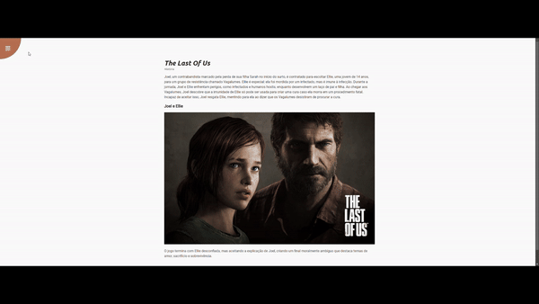

# 🎮 The Last Of Us Página Interativa
  

## 🔎 Descrição

Esta é uma página web interativa inspirada na história de "The Last of Us". O projeto inclui funcionalidades como navegação interativa, modais para exibição de informações adicionais e um menu dinâmico com transições suaves.

## ✨ Recursos Principais

- **História e Conteúdo:** Apresenta um resumo da história de "The Last of Us" com texto e imagens.

- **Navegação Dinâmica:** Um menu lateral interativo que pode ser aberto e fechado.

- **Modais Personalizados:** Dois modais para apresentação de informações adicionais:

    - Modal de "Sobre" com informações sobre o desenvolvedor.

    - Modal de "Contato" com links para GitHub e LinkedIn.

- **Interatividade Aprimorada:** Lógica que impede a navegação ou a sobreposição de modais abertos.

## 💻Tecnologias Utilizadas

- **HTML:** Estrutura da página.

- **CSS:** Estilização responsiva e efeitos de transições suaves.

- **JavaScript:** Controle da interatividade, incluindo navegação e exibição de modais.

- **Font Awesome:** Ícones utilizados no menu e nos links dos modais.

## 📋 Como Utilizar
 1. Clone este repositório:
    ```bash
        git clone https://github.com/DanRodris/interactive-page.git
    ```    
 2. Abra o arquivo **index.html** em seu navegador.   

 ## 🌐 Estrutura do Projeto

 ```plaintext
    ┌── index.html      # Estrutura principal da página
    ├── style.css       # Estilos para a página e modais
    └── script.js      # Funções JavaScript para interatividade
    └── README.md           # Documentação do projeto
 ```

 ## 🔧 Funcionalidades do Script

 - **Abrir/Fechar Menu:**

   - Botões interativos para abrir e fechar o menu lateral.

- **Abrir/Fechar Modais:**

  - Funções para gerenciar a exibição dos modais de "Sobre" e "Contato".

- **Prevenção de Conflitos:**

  - Impede que outro modal seja aberto enquanto um modal já estiver visível.

  - Bloqueia a navegação para a página inicial enquanto um modal estiver aberto.

## 🖼️ Demonstração Visual

## Demonstração do Projeto




## 🤝 Contribuições
Contribuições são bem-vindas! Para contribuir:

1. Faça um fork deste repositório.
2. Crie um branch para sua funcionalidade:
    ```bash
       git checkout -b minha-funcionalidade
    ```
    
3. Envie um pull request.

## 👤Autor
Desenvolvido por Danilo Rodrigues. Para mais informações, visite:

-  [GitHub](https://github.com/DanRodris/)
- [Linkedin](https://www.linkedin.com/in/danrodris7/)

## 🖊️ Licença
Este projeto está sob a licença [MIT](https://choosealicense.com/licenses/mit/). Consulte o arquivo LICENSE para mais detalhes.
